# 🛡️ Hybrid Cloud Security Monitoring System (SSH Brute Force Detection)


A robust **Hybrid Cloud Security System** that bridges On-Premise infrastructure (Proxmox Virtual Environment) with AWS Serverless services. This project detects **SSH Brute Force attacks** in real-time, performs automated forensic analysis (IP Geolocation & User tracking), and sends detailed alerts to Telegram.

## 🏗️ Architecture Topology

```mermaid
flowchart LR
    %% Definisi Style %%
    classDef aws fill:#FF9900,stroke:#232F3E,color:white,stroke-width:2px;
    classDef onprem fill:#5A6B86,stroke:#232F3E,color:white,stroke-width:2px;
    classDef monitor fill:#E7157B,stroke:#232F3E,color:white,stroke-width:2px;
    classDef app fill:#0088cc,stroke:#232F3E,color:white,stroke-width:2px;

    subgraph OnPrem ["🏢 On-Premise (Proxmox)"]
        direction TB
        Attacker[("👾 Attacker")]
        VM[("💻 Linux Server")]
        Agent[("⚙️ CW Agent")]
    end

    subgraph AWS ["☁️ AWS Cloud"]
        direction LR
        CWLogs[("📄 Logs")]
        Filter[("🔍 Metric Filter")]
        Alarm[("⏰ Alarm")]
        SNS[("🔔 SNS")]
        Lambda[("λ Lambda (Python)")]
    end

    subgraph User ["📱 End User"]
        Telegram[("Telegram Bot")]
    end

    %% Flow %%
    Attacker -->|SSH Brute Force| VM
    VM -->|Auth Log| Agent
    Agent -->|HTTPS Stream| CWLogs
    CWLogs --> Filter
    Filter -->|Threshold > 3| Alarm
    Alarm --> SNS
    SNS -->|Trigger| Lambda
    Lambda -->|1. Query Insight| CWLogs
    Lambda -->|2. Geo-Enrichment| Telegram

    %% Styles %%
    class Lambda,SNS aws;
    class VM,Agent,Attacker onprem;
    class CWLogs,Filter,Alarm monitor;
    class Telegram app;

```



## 🚀 Key Features

* **Hybrid Connectivity:** Monitors local VMs (Private IP) without exposing them directly to the internet, using AWS CloudWatch Agent.
* **Real-time Threat Detection:** Uses CloudWatch Metric Filters to detect specific attack patterns (Regex: `Failed password`) with a threshold of >3 failures per minute.
* **Automated Forensics:** AWS Lambda performs a "Look-back Query" to CloudWatch Logs Insights to extract:
* 🕵️ **Attacker IP**
* 👤 **Targeted Username**
* ⏰ **Timestamp (WIB/Local Time)**


* **Geo-Location Enrichment:** Automatically resolves IP addresses to physical locations (City, Country, ISP) using public APIs.
* **Instant Alerting:** Delivers formatted, actionable intelligence reports to a Telegram Group.

## 🛠️ Tech Stack & Tools

* **Infrastructure:** Proxmox VE, Ubuntu Server 22.04.
* **AWS Services:**
* **CloudWatch:** Logs ingestion, Metric Filters, Alarms.
* **Lambda:** Python 3.12 runtime for logic & orchestration.
* **SNS (Simple Notification Service):** Asynchronous trigger management.


* **Scripting:**
* **Python:** `boto3`, `urllib3`, `ipaddress`.
* **Bash:** System configuration & testing.


* **Testing Tools:** Custom Python script (`paramiko`) for simulating distributed Brute Force attacks.

## 📸 Demo Screenshots


> *Telegram Alert showing IP Geolocation and Attacker Details:*

## 💻 Setup & Commands (Terminal)

Here are the essential commands used to configure the On-Premise environment and run the simulation.

### 1. Network Optimization

Fixes **Connection Reset** and **DNS Timeout** issues in hybrid/home-lab setups.

```bash
# 1. Fix MTU (Prevent Connection Reset by Peer)
# Replace 'ens18' with your actual interface name
sudo ip link set dev ens18 mtu 1400

# 2. Fix DNS (Force Google DNS)
sudo rm -f /etc/resolv.conf
sudo bash -c 'echo "nameserver 8.8.8.8" > /etc/resolv.conf'

```

### 2. CloudWatch Agent Control

```bash
# Check Status
sudo /opt/aws/amazon-cloudwatch-agent/bin/amazon-cloudwatch-agent-ctl -m onPremise -a status

# Restart Agent (Apply config)
sudo /opt/aws/amazon-cloudwatch-agent/bin/amazon-cloudwatch-agent-ctl -m onPremise -a stop
sudo /opt/aws/amazon-cloudwatch-agent/bin/amazon-cloudwatch-agent-ctl -m onPremise -a fetch-config -c file:/opt/aws/amazon-cloudwatch-agent/bin/config.json -s

```

### 3. Running Attack Simulation

```bash
# Install dependency
pip install paramiko

# Run the attack script
python attack.py

```

## ☁️ AWS Cloud Configuration (Console Steps)

### 1. Create Metric Filter

* **Go to:** CloudWatch > Log groups > `Hybrid-Server-Logs` > Metric filters.
* **Pattern:** `[month, day, time, host, process="sshd*", message="Failed password*"]`
* **Metric Value:** `1`

### 2. Create CloudWatch Alarm

* **Threshold:** Static, Greater/Equal `>= 3`.
* **Action:** Send notification to SNS Topic (`SSH-Alert-Topic`).

### 3. Configure Lambda

* **Runtime:** Python 3.12.
* **Trigger:** SNS (`SSH-Alert-Topic`).
* **Permissions (IAM):** Attach `CloudWatchLogsReadOnlyAccess` policy to the Lambda Execution Role (Required for log querying).

## ⚠️ Challenges & Solutions

During the implementation, several networking challenges were encountered and resolved:

* **Log Latency:** Tuned the Agent's `force_flush_interval` to **5 seconds** for near real-time ingestion.
* **Connection Reset by Peer:** Diagnosed and fixed an MTU mismatch issue between the local ISP and AWS endpoints by lowering MTU size.
* **Timezone Sync:** Implemented a UTC-to-WIB (UTC+7) converter in Python to ensure forensic logs match local time.

## 🔮 Future Roadmap

* [ ] **Auto-Blocking:** Automatically add the attacker's IP to the Network ACL (NACL) or Security Group.
* [ ] **Dashboard:** Create a CloudWatch Dashboard to visualize attack trends.
* [ ] **Multi-Channel Alert:** Integrate with Slack or Discord.

---

*Created by **Andi Yusdar Al Imran** - 2026*
